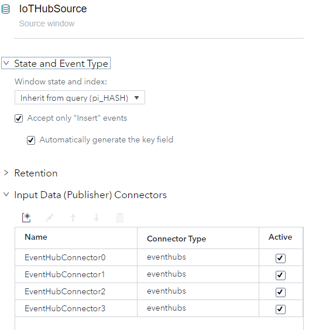

# How To Process Azure IoT Hub Messages With SAS ESP 

In this repository you will learn how to process messages from an Azure IoT Hub with a [SAS Event Stream Processing](https://www.sas.com/en_us/software/event-stream-processing.html) (ESP) project.

## Table of Contents

* [Prerequisites](#prerequisites)
* [Overview](#overview)
* [Create IoT Hub and IoT Device](#create-iot-hub-and-iot-device)
* [Simulated Sensor data](#simulated-sensor-data) 
* [IoT Hub built-in Event Hub endpoint](#connecting-the-logic-app-to-the-event-hub)
* [ESP Project](#esp-project)
  * [Event Hub Connector](#event-hub-connector)
  * [Running](#running)
* [Contributing](#contributing)
* [License](#license)
* [Additional Resources](#additional-resources)

## Prerequisites

SAS Event Stream Processing

Azure Account


## Overview

In this project we will configure a simulated IoT Device to send sensor data to an IoT Hub, configure the IoT Hub to expose the message stream via an event hub endpoint, and then connect a SAS Event Stream Processing project to process the messages.  


### Create IoT Hub and IoT Device

For this example you will need to create or use an existing Azure IoT Hub.  This example can also be done with a standard free (F1) instance. 

To create an IoT device go to the IoT Devices section of the IoT Hub and click New. Call the new device SimulatedPi. 


To get the connection string from your new device click on the device and get the Primary Connection String.  Copy this string for use in the next step. 


### Simulated Sensor data

For this example we will work with the [Raspberry Pi Azure IoT Online Simulator](https://azure-samples.github.io/raspberry-pi-web-simulator/#Getstarted).  The simulator is preconfigured to simulate reading temperature and humidity from a BME280 and can send the data to an Azure IoT Hub. 

Paste in the connection string for your device into the code in the simulator in this line (line 15):

```javascript
const connectionString = '[Your IoT hub device connection string]';
```

Additionally you should comment out the messageId property, instead we will generate a messageId in ESP which will guarantee uniqueness.
(line 23)
```javascript
function getMessage(cb) {
  messageId++;
  sensor.readSensorData()
    .then(function (data) {
      cb(JSON.stringify({
        //messageId: messageId,
        deviceId: 'Raspberry Pi Web Client',
        temperature: data.temperature_C,
        humidity: data.humidity
      }), data.temperature_C > 30);
    })
    .catch(function (err) {
      console.error('Failed to read out sensor data: ' + err);
    });
}
```

To run the simulator click the run button on the simulator. 

If the connection string is correct you should see output similar to this:

```
Sending message: {"deviceId":"Raspberry Pi Web Client","temperature":29.43879914371387,"humidity":62.38023473529732}
> 
Message sent to Azure IoT Hub
```

The simulator is being used to demonstrate an IoT device.  Code you enter will not be saved.  To learn how to create a code project that sends telemetry to IoT Hub refer to the [Microsoft Quickstart Send Telemetry](https://docs.microsoft.com/en-us/azure/iot-hub/quickstart-send-telemetry-dotnet#send-simulated-telemetry).

### IoT Hub built-in event hub endpoint

An Azure IoT Hub contains a built-in Event Hub endpoint.  This endpoint is really a free message route.  If you manually create other message routes the built-in Event Hub endpoint will be disabled.  In that situation you will need to manually create a message route to an external Event Hub.

For more information on messaging routing: [Microsoft Message Routing Documentation](https://docs.microsoft.com/en-us/azure/iot-hub/iot-hub-devguide-messages-d2c)

To get the event hub connection parameters, go to the built-in endpoint:


Note the following settings that will be used to connect to the IoT Hub:
- Event Hub-compatible endpoint
- Event Hub-compatible name
- Consumer Group name
- partitions

The default consumer group can be used for this demo.  A recommended practice for event hubs is to create an additional consumer group for each consumer.  A consumer group contains the message offset into the hub, and tracks which messages have been received.  If multiple consumers share a consumer group, messages may not be received by all consumers.  

For more on Azure Event Hub features please consult: [Microsoft: Features and terminology in Azure Event Hubs](https://docs.microsoft.com/en-us/azure/event-hubs/event-hubs-features)

### ESP Project

The ESP Project will be used to process the messages from the IoT Hub.  The source window will use the Event Hub connector to subscribe to the IoT Hub.


####  Event Hub Connector

The source window Event Hub connector will be configured to read the latest messages on the IoT Hub.

The following fields need to be specified in the connector: 
| Property | Explaination | 
|----------|---------------|
| type | 'pub' to receive message in project |
| eventhubconnectionstring | The connection string of your event hub, in the IoT Hub builtin endpoint this is the Event Hub-compatible endpoint |
| eventhubspath | name of the Event Hub instance inside your Event Hub namespace.  In the IoT Hub this is the Event Hub-compatible name |
| eventhubsconsumergroup | name of the consumer group to receive the data |
| eventhubspartition | id of the partition to read from, 0 is the first partition.  IoT Hubs have four partitions. |
| eventhubsformat | json, csv, or avro |


Here is the xml for the connector:
```xml
<connector class="eventhubs" name="EventHubConnector0">
      <description><![CDATA[Partition 0]]></description>
      <properties>
        <property name="type"><![CDATA[pub]]></property>
        <property name="eventhubsconnectionstring"><![CDATA[Event Hub-compatible endpoint]]></property>
        <property name="eventhubspath"><![CDATA[Event Hub-compatible name]]></property>
        <property name="eventhubsconsumergroup"><![CDATA[$default]]></property>
        <property name="eventhubspartition"><![CDATA[0]]></property>
        <property name="eventhubsformat"><![CDATA[json]]></property>
      </properties>
    </connector>
```

Because the connector only subscribes to a single partition to receive all the messages we need a connector for each partition.  So we will have four instances of the connector, one for each of our four partitions.  Each instance of the connector will use the same connection parameters except the partition id.




See the [code\project.xml](code\project.xml) for the complete xml for the project.

Once the connector is created the schema for the source window must be specified.  This is the body of the device message.  You can define the schema with the following xml:

```xml
<schema>
  <fields>
    <field name="messageId" type="int64" key="true"/>
    <field name="deviceId" type="string"/>
    <field name="temperature" type="string"/>
    <field name="humidity" type="string"/>
  </fields>
</schema>
```

### Running

After you've completed the above steps and configured your ESP project with your IoT Hub parameters you're ready to run the ESP project.

To start messages flowing into the IoT Hub from the simulator, click the run button.

You should see messages printed in the simulator.  If you see a connection error message your device connection string is incorrect.

You can run the ESP Project using ESP Studio Test Run feature or by deploying it to an ESP Server.  If you monitor the events from the Source window you should see something that looks like: 


As messages are sent from the simulator they should show in the ESP events in near real-time.

## Contributing

> We welcome your contributions! Please read [CONTRIBUTING.md](CONTRIBUTING.md) for details on how to submit contributions to this project. 

## License

> This project is licensed under the [Apache 2.0 License](LICENSE).

## References:
* [SAS Event Stream Processing](https://www.sas.com/en_us/software/event-stream-processing.html)
* [Azure EventHub Connector](http://pubshelpcenter.unx.sas.com:8080/test/doc/en/espcdc/v_007/espca/n1taf3y2zsqskon115o5vjbueevf.htm)

